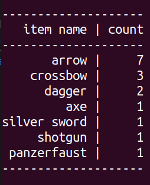

# Python-exercise-3-Game-inventory
> Another small project performed while learning Python in CodeCool. 
> The aim was to implement the inventory system of the game which would store, show and manage the acquired goods of the player.

## General info
Tasks covered by the created functions:
* Displaying inventory
* Adding new elements to the inventory
* Removing elements from the inventory
* Printing inventory in the form of table

* Importing inventory items from the csv file
* Exporting inventory items to the csv file

## Main challenges
The most important issues learned in the process:
* Getting familiar with dictionaries
* Printing flexible tables
* Using f-string formatting
* Working with files
* Handling exeptions

## Technologies
* Python 3.6

## Credits:
* Task content, related learning materials and test file delivered by Codecool.
